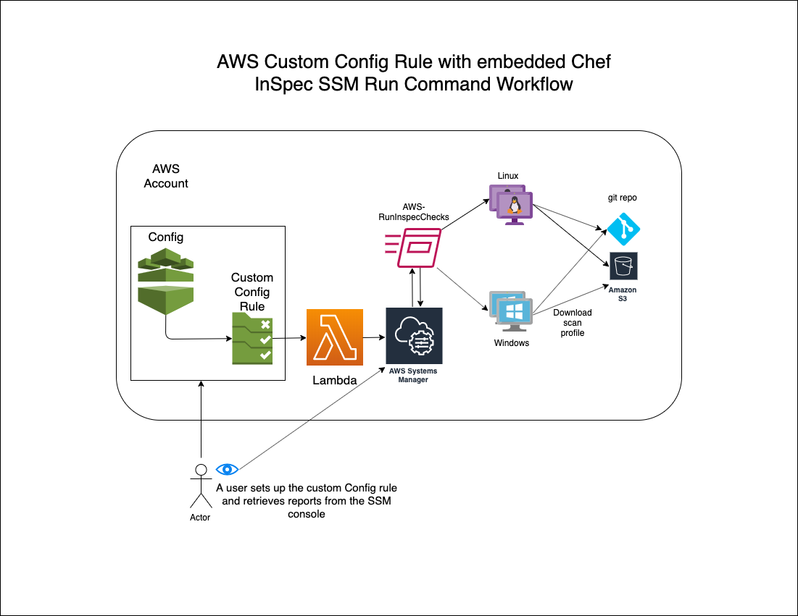
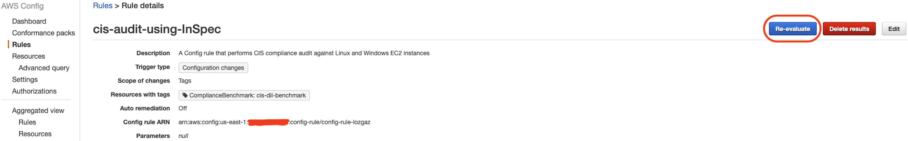
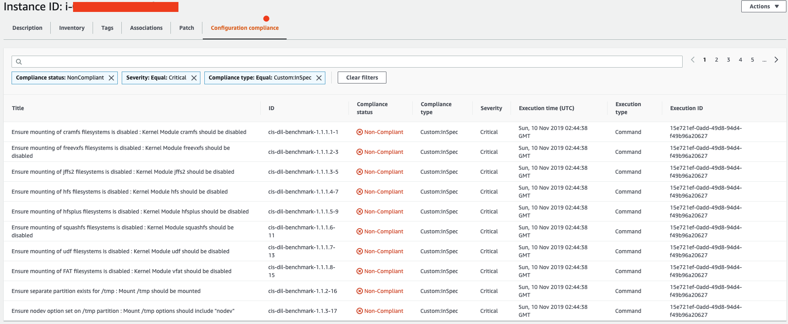

**Setting up custom AWS Config rule that checks the OS CIS compliance**

AWS announced that AWS Systems Manager’s Run Command now offers Chef InSpec audits through the AWS-RunInspecChecks document. This is a significant win for Systems Manager enthusiasts and other users who prefer an OS-based compliance check solution rather than using a whole new cloud service.

This blog post is not about how to keep an OS compliant but it’s about giving AWS customers a more cost-friendly choice, while encouraging wider adoption of AWS Config by creating a custom rule with which users can monitor their instances. There is already a [blog](https://aws.amazon.com/blogs/mt/using-aws-systems-manager-to-run-compliance-scans-using-inspec-by-chef/) regarding how to execute Chef InSpec audits via the AWS-RunInspecChecks SSM document; this blog post focuses on how to set it up as a custom AWS Config rule that checks the CIS compliance.


[Chef InSpec](https://www.inspec.io/) is an open-source framework for testing and validating applications and infrastructure configuration. It is based on Ruby’s Spec Suite, but InSpec comes with its own DSL (Domain Specific Language). From all the features of InSpec, one important thing to highlight is the term compliance profile.

A compliance profile in Chef InSpec is a set of controls. Controls describe the desired state of the application or the infrastructure, such as proper owners, group, or permissions for files or directories. All Chef InSpec audits are performed using one or more of these compliance profiles. While InSpec provides the framework, the compliance profiles are the core contents of the compliance audit. All audits must run against a standard that can be read and understood by an audit process. While it is possible for someone to write a brand-new compliance profile for CIS OS audits, it is far better to use existing ones. For this article, I use a dev-sec-maintained CIS DIL (Distribution-Independent Linux) profile written for the Chef InSpec audit, which is publicly available via [a github repository](https://github.com/dev-sec/cis-dil-benchmark)

**Solution Architecture**

The following diagram illustrates the architecture of the solution



When the custom Config rule is executed, it sends the event information to the Lambda function. The Lambda function extracts the EC2 instance name from the event information and calls the Systems Manager Run Command with the Instance name as one of the parameters. The Chef InSpec is executed as a result of the Systems Manager Run Command and the result is stored in the Systems Manager.

A custom AWS Config rule uses AWS Lambda as its backend. This solution uses the combination of a Lambda function and Systems Manager to perform an OS-level CIS compliance audit. For this article, I use [cis-dil](https://github.com/dev-sec/cis-dil-benchmark) (CIS Distribution Independent Linux) benchmark auditing, available in GitHub.

**Implementation**

For an automated implementation of the custom Config rule, please use [this Cloudformation template](https://github.com/aws-samples/aws-config-custom-rule-os-compliance/blob/master/config-rule-inspec-cis-audit-lambda.template) or click on the following link to start the creation of the Cloudformation stack:

[Launch Stack](https://console.aws.amazon.com/cloudformation/home?region=us-east-1#/stacks/new?stackName=config-rule-inspec-cis-compliance&templateURL=https://custom-aws-config-rule-that-checks-the-os-cis-compliance.s3.amazonaws.com/config-rule-inspec-cis-audit-lambda.template)

To implement the solution, you must complete the following five individual tasks. While the AWS CloudFormation template above implements nearly all tasks, there are some tasks that you must perform manually:

1. Assign the required IAM role to the backend Lambda function. (The AWS CloudFormation template automates this task.) Permission is required to perform the following actions from Systems Manager and AWS Config:
    1. ssm:UpdateInstanceInformation
    2. ssm:SendCommand
    3. ssm:GetCommandInvocation
    4. config:PutEvaluations
2. Create a custom AWS Config rule backend Lambda function. A URL to the code is provided in a following section of this blog post. The AWS CloudFormation template creates the Lambda function with the necessary permissions.
3. Create an Instance Profile Role and assign it to your Amazon EC2 instances. The AWS CloudFormation template creates a new role (EC2RoleforSSM), which can be assigned to Amazon EC2 instances. You must assign this role to the instances manually using the console or perform automation using Systems Manager during or after the Amazon EC2 instance launch.
4. Create the custom AWS Config rule. The AWS CloudFormation template performs this task.
5. Add your GitHub token (to access DevSec’s Inspect Profile) in the SSM Parameter Store. This must be done manually with your customization. See the following sections for instructions.

**Required IAM role for the backend Lambda**

A custom AWS Config rule requires a backend Lambda function that performs the compliance determination. For this solution’s Lambda function, the following are the required permissions for the role:

- AWSLambdaExecute (AWS managed)
- AWSConfigRulesExecutionRole (AWS managed)

ssm-and-config-permission-requirements (inline)
```json
{
    "Version": "2012-10-17",
    "Statement": [
        {
            "Action": [
                "ssm:UpdateInstanceInformation",
                "ssm:SendCommand",
                "ssm:GetCommandInvocation",
                "config:PutEvaluations"
            ],
            "Resource": "*",
            "Effect": "Allow"
        }
    ]
}
``` 
AWS CloudFormation creates an IAM role named <em>IAMRoleForcis-compliance-with-chef-inspec</em>, with the IAM policy previously described attached.

**Create a lambda function with the provided code**

The [Lambda function code](https://github.com/aws-samples/aws-config-custom-rule-os-compliance/blob/master/CisScanningLambda.py) is embedded into the AWS CloudFormation template under the Lambda function. A separate file has been set up for review purposes only.


**Create a new instance profile for the EC2 instances**

To successfully execute the AWS Config rule, the Amazon EC2 instances must be allowed to perform certain SSM actions in addition to the actions that come with the base. The following is needed for the instance profile:

  - AmazonSSMManagedInstanceCore (AWS managed)

The AWS CloudFormation template creates the new role (EC2RoleforSSM), but you must assign this role to the instances manually during or after the Amazon EC2 instance launch.


**Create the custom Config rule**
An AWS Config rule requires the following building blocks:

- When to trigger the evaluation (periodic or event-driven)
- Where to run the evaluation (such as Amazon EC2 instances or Amazon S3 buckets)
- The correct tool to run the evaluation (Integration with other AWS services like Systems Manager or the OS commands)

The AWS CloudFormation template automatically creates the custom AWS Config rule with the following building blocks:

- **When to trigger the evaluation**: Whenever a change is detected on any Amazon EC2 instances
- **Where to run the evaluation**: Any AWS resources with the following tag (**Key**: ComplianceBenchmark, **Value**: cis-dil-benchmark)
- **The correct tool**: The Systems Manager Run Command executes the AWS-RunInspecChecks document, which in turn executes a Chef InSpec audit with a specific compliance profile. In this case, the Lambda function is coded to use the cis-dil standard available from the dev-sec’s GitHub repository.
 

After AWS CloudFormation has completed, log into the AWS Management Console and open the AWS Config service. Choose Rules and locate the rule name you just created. The AWS Config rule automatically starts the evaluation process after it is created.

 
If no result is visible, ensure that your Amazon EC2 instances are tagged properly (**Key**: ComplianceBenchmark, **Value**: cis-dil-benchmark), then choose Re-evaluate to execute the audit again.


**Add the GitHub token in the SSM Parameter Store**
This solution assumes that you already have a GitHub account.

The GitHub token helps access GitHub repositories, such as DevSec’s Inspect profiles. This step stores the token in the SSM Parameter Store as a secure string.

1. If you have not done so already, [create a token in your GitHub account.](https://help.github.com/en/github/authenticating-to-github/creating-a-personal-access-token-for-the-command-line)
2. Use the AWS CLI to create the parameter store.
    aws ssm put-parameter –name ‘github-personal-token’ –description ‘GitHub Personal Token’ –type SecureString –value ‘<value>’ –region ‘<value>’
3. Use the following command to confirm the parameter:
    aws ssm get-parameter –name ‘github-personal-token’ –with-decryption –region ‘<value>’
4. After the command you should see the following output:

```json
{
    "Parameter": {
        "Name": "github-personal-token",
        "LastModifiedDate": 1111111111.111,
        "Value": "a1b2c3d4e5aabbccddeeaabbccddeeaabbccdd",
        "Version": 1,
        "Type": "SecureString",
        "ARN": "arn:aws:ssm:<region>:123456789012:parameter/github-personal-token"
    }
}
```


**Execution**
The following conditions must be met in order for the CIS scan to be performed:

- There has to be a resource change to an Amazon EC2 instance.
- The resourceType has to be AWS::EC2::Instance.
- The Amazon EC2 instance must have the following tag to be defined:
  **Key**: ComplianceBenchmark
  **Value**: cis-dil-benchmark


After successfully creating the AWS CloudFormation stack or manually performing the individual tasks above, you should now have the custom AWS Config rule. In order to execute it, perform the following steps:

1. Open the AWS Config console.
2. Choose Rules.
3. Choose the cis-audit-using-InSpec rule.
4. If the compliance has not been reported, choose Re-evaluate to reassess.




**Access the report**

Chef InSpec’s cis-dil standard checking takes roughly one minute or less. Amazon Inspector recommends a one-hour scan so as not to degrade the operating system’s performance.  While this one hour can be reduced to 15 minutes (via the console) or less (via the AWS CLI), one may not need all the other features of the Amazon Inspector. In a fast-moving environment in which a quick evaluation result is all that is needed, a Chef InSpec check using Systems Manager’s Run Command could be a great lightweight alternative. Some examples are Golden Image baking processes or a maintenance window activity.

One of the areas in which the Chef InSpec check can improve is reporting. Currently, one must visit the Systems Manager console and chose Compliance, then choose the Amazon EC2 instance ID under the Resource pane. This brings up a new browser window showing each audit item and the result. An easy filtering set follows:

- Compliance type: Equal: Custom:InSpec
- Compliance status: NonCompliant
- Severity: Equal: Critical
This brings up urgent topics an administrator must address immediately, as seen in the following screenshot:



## Conclusion:

In this blog post, I explained what is required for a custom AWS Config rule and showed how to accomplish an OS compliance with the help of a custom AWS Config rule. The advantage of having compliance visibility in both Systems Manager and AWS Config cannot be understated. By integrating with AWS Config, you have timeline information in which you can clearly tell when the instance fell in or out of compliance.  To get started please check out the Related Links below.


## Related links:

Getting started with custom config rules: [https://docs.aws.amazon.com/config/latest/developerguide/evaluate-config\_develop-rules.html](https://docs.aws.amazon.com/config/latest/developerguide/evaluate-config_develop-rules.html)

AWS Config Rule Development Kit: [https://github.com/awslabs/aws-config-rdk](https://github.com/awslabs/aws-config-rdk) (Caution: this is an open beta product)

Repository of Config rules: [https://github.com/awslabs/aws-config-rules/](https://github.com/awslabs/aws-config-rules/)

Getting Started with Systems Manager: [https://aws.amazon.com/systems-manager/getting-started/](https://aws.amazon.com/systems-manager/getting-started/)

AWS Systems Manager Documentation: [https://docs.aws.amazon.com/systems-manager/index.html#lang/en\_us](https://docs.aws.amazon.com/systems-manager/index.html#lang/en_us)

AWS Systems Manager Development Github Repo: [https://github.com/awslabs/aws-systems-manager](https://github.com/awslabs/aws-systems-manager)

## About the author:

Andrew Park is a Cloud Infrastructure Architect at Amazon Web Services.  With over 20 years of experience as a Linux Systems Administrator and a Cloud Engineer, Andrew is passionate about deep dives into Linux-related challenges, automation and solution development.   He is an open source advocate, dog lover and a hobbyist martial art competitor.
